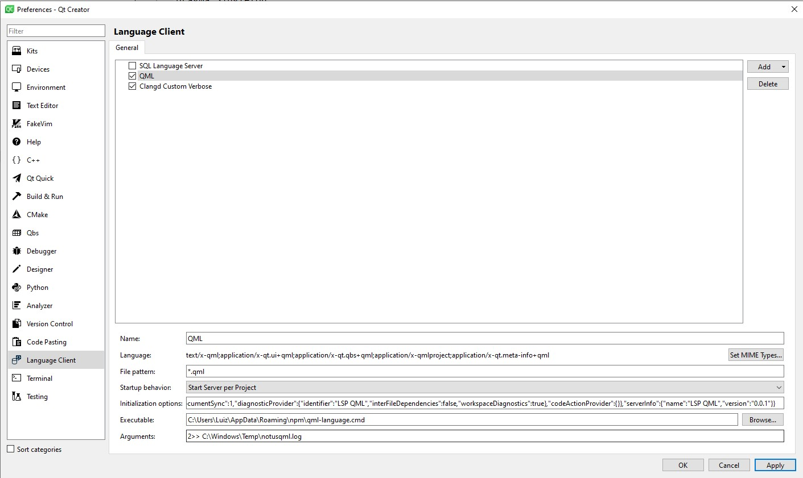
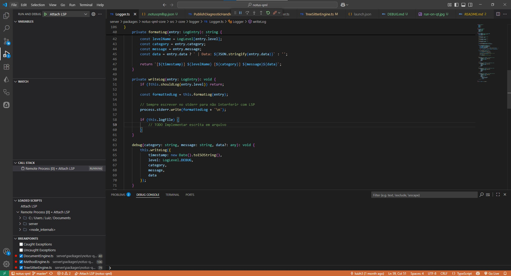

### This document define how debug LSP in another IDE

For example, when's runs qml-language define on server/package.json on QT Creator it's possible debug, for this is necessary 
start de process of QT directly on the terminal, and before defining a variable that defines that any node in the process runs in debug.

Example

    Windows:
    
        $env:NODE_OPTIONS="--inspect-brk"
        C:\Qt\Tools\QtCreator\bin\qtcreator.exe
    
### Configuration on QT

> Attach process on VSCode to debug.

