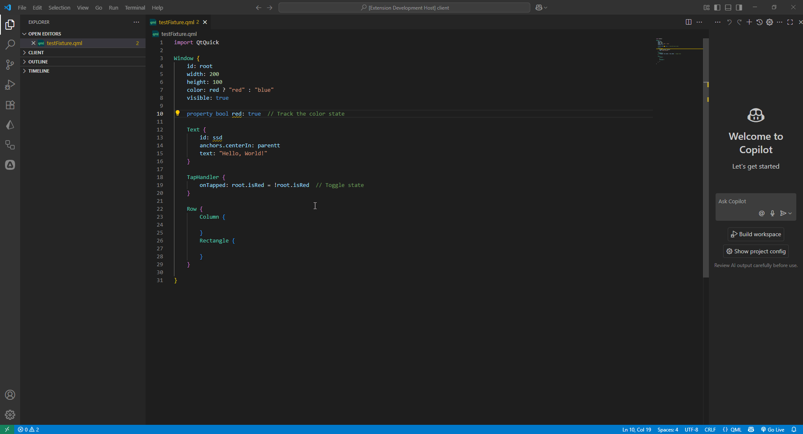

<div align="center">
  
  
  **A Language Server Protocol (LSP) for QML with plugin support**
  
  [](https://www.typescriptlang.org/)
  [](https://nodejs.org/)
  [](LICENSE)
  [](https://github.com/your-username/notus-qml/releases)
</div>

---

## Overview

NotusQML is a comprehensive Language Server Protocol (LSP) implementation for the QML language that provides:

- **Plugin Architecture**: Easy integration of custom plugins and rules
- **Tree-sitter Integration**: Advanced AST parsing and analysis
- **Modular Design**: Clean separation of concerns with dedicated engines
- **Testing Framework**: Built-in testing capabilities for plugins and rules
- **CLI Tools**: Powerful command-line tools for development
- **TypeScript**: Written in TypeScript for better type safety and developer experience

## Features

### Core Features
- **Language Server Protocol (LSP)** implementation for QML
- **Tree-sitter AST Engine** for advanced code parsing and analysis
- **Plugin System** for extensible functionality
- **Rule Engine** for custom language rules and validations
- **Method Registry** for handling LSP methods with proper dispatching
- **Document Engine** for managing QML documents
- **Comprehensive Error Handling** with detailed logging

### Development Tools
- **Module Generator CLI** for creating new plugins and rules
- **Test Framework** for plugin and rule testing
- **Plugin & Rule Engines** for managing modules
- **Logger System** for debugging and monitoring
- **AST Traverser & Visitors** for code analysis

### LSP Methods Supported
- `initialize` - Server initialization
- `textDocument/diagnostic` - Code diagnostics and error reporting
- `textDocument/completion` - Code completion suggestions
- `textDocument/codeAction` - Code actions and refactoring
- `textDocument/didOpen` - Document open handling
- `textDocument/didChange` - Document change handling
- `textDocument/formatting` - Code formatting

## Quick Start

### Prerequisites
- Node.js (v16 or higher)
- TypeScript
- npm or yarn

### Installation

1. **Clone the repository**
   ```bash
   git clone https://github.com/your-username/notus-qml.git
   cd notus-qml
   ```

2. **Install dependencies**
   ```bash
   npm install
   cd server && npm install
   cd ../client && npm install
   ```

3. **Build the project**
   ```bash
   cd server
   npm run build
   ```

4. **Start the server**
   ```bash
   npm start
   ```

## 📁 Project Structure

```
notus-qml/
├── client/                          # VS Code extension client
│   ├── src/
│   │   └── extension.ts            # VS Code extension entry point
│   └── package.json
├── server/                          # LSP server implementation
│   ├── src/
│   │   ├── core/                   # Core engine and architecture
│   │   │   ├── ast/               # Abstract Syntax Tree handling
│   │   │   │   ├── engine/        # AST engines (Tree-sitter)
│   │   │   │   ├── traverser/     # AST traversal logic
│   │   │   │   └── visitor/       # AST visitors for analysis
│   │   │   ├── builder/           # Builders for modules
│   │   │   ├── context/           # Context management
│   │   │   ├── dispatcher/        # Method dispatching
│   │   │   ├── document/          # Document management
│   │   │   ├── engine/            # Core engines
│   │   │   │   ├── module/        # Plugin and Rule engines
│   │   │   │   └── MethodEngine.ts
│   │   │   ├── handler/           # LSP method handlers
│   │   │   │   └── methods/       # Specific method implementations
│   │   │   ├── logger/            # Logging system
│   │   │   ├── manager/           # Resource management
│   │   │   └── singleton/         # Application singleton
│   │   ├── plugins/               # Plugin implementations
│   │   ├── rules/                 # Custom rules
│   │   ├── test-framework/        # Testing utilities
│   │   │   ├── executor/          # Test executors
│   │   │   └── types/             # Test type definitions
│   │   ├── types/                 # TypeScript type definitions
│   │   │   ├── ast/               # AST types
│   │   │   ├── lsp/               # LSP protocol types
│   │   │   └── module.types.ts    # Module system types
│   │   ├── methods.ts             # Method registry configuration
│   │   └── server.ts              # Server entry point
│   ├── tools/                     # CLI tools and generators
│   │   └── module-generator/      # Plugin/Rule generator
│   │       ├── templates/         # Code templates
│   │       └── types/             # Generator types
│   ├── tree-sitter-qmljs/         # Tree-sitter QML grammar
│   └── package.json
└── README.md
```

## 🔌 Plugin Development

### Creating a Plugin

Use the CLI generator to create a new plugin:

> OBS: Now is outdated generate by CLI

```bash
cd server
npm run cli:generator make:plugin my-awesome-plugin
```

### Plugin Structure
```typescript
// Example: property-needs-prefix-plugin
import { DiagnosticReportContext } from "@/core/context/DiagnosticReportContext";
import { ASTNode } from "@/types/ast/ast.types";
import { DiagnosticSeverity } from "@/types/lsp/document.types";

module.exports = {
  handlers: {
    'property-needs-prefix': {
      create: (context: DiagnosticReportContext) => ({
        ui_property: (node: ASTNode) => {
          const IDENTIFIER_INDEX = 2;
          
          const identifierNode = node.children[IDENTIFIER_INDEX];
          
          const hasPrefix = identifierNode.text.startsWith("_") || identifierNode.text.startsWith("v");
          
          if (hasPrefix) {
              return;
          };
          
          context.report({
            node: identifierNode,
            item: {
              message: "Property name needs a prefix!",
              severity: DiagnosticSeverity.Warning
            }
          });
        }
      })
    }
  }
};
```

### Plugin with ASTNodeFinder (Recommended)
```typescript
// Example: using ASTNodeFinder for cleaner code
import { DiagnosticReportContext } from "@/core/context/DiagnosticReportContext";
import { ASTNode } from "@/types/ast/ast.types";
import { DiagnosticSeverity } from "@/types/lsp/document.types";
import { ASTNodeFinder } from "@/core/ast/finder";

module.exports = {
  handlers: {
    'binding-validator': {
      create: (context: DiagnosticReportContext) => ({
        ui_object_definition: (node: ASTNode) => {
          const finder = new ASTNodeFinder(node);
          
          // Find specific binding
          const idBinding = finder.findBindingByName("id");
          if (idBinding) {
            const idValue = finder.getBindingValue("id");
            if (idValue && idValue.text === "invalid") {
              context.report({
                node: idValue,
                item: {
                  message: "Invalid ID value!",
                  severity: DiagnosticSeverity.Error
                }
              });
            }
          }
          
          // Check for required bindings
          if (!finder.hasBinding("width")) {
            context.report({
              node: node,
              item: {
                message: "Missing required 'width' binding!",
                severity: DiagnosticSeverity.Warning
              }
            });
          }
        }
      })
    }
  }
};
```

### Creating a Rule

```bash
cd server
npm run cli:generator make:rule my-custom-rule
```

### Rule Structure
```typescript
// Example: property-needs-prefix-rule
import { DiagnosticReportContext } from "@/core/context/DiagnosticReportContext";
import { ASTNode } from "@/types/ast/ast.types";
import { DiagnosticSeverity } from "@/types/lsp/document.types";

module.exports = {
    handlers: {
        'property-needs-prefix': {
            create: (context: DiagnosticReportContext) => ({
                ui_property: (node: ASTNode) => {
                    const IDENTIFIER_INDEX = 2;

                    const identifierNode = node.children[IDENTIFIER_INDEX];

                    const hasPrefix = identifierNode.text.startsWith("_") || identifierNode.text.startsWith("v");

                    if (hasPrefix) {
                        return;
                    };

                    context.report({
                        node: identifierNode,
                        item: {
                            message: "Property name needs a prefix!",
                            severity: DiagnosticSeverity.Warning
                        }
                    });
                }
            })
        }
    }
};
```

> <b>OBS:</b> Plugins and rules has the same declaration.

## Testing

> Creating a test

When using the CLI, two files will be created, the plugin or rule file, and a test file.
To test the implemented rules or plugins, the project provides some functionalities, the main ones being `TestExecutor` and `TestUtils`.

>Test Executor
>> Represents the class responsible for executing the tests
        
>Test Utils
>> Provides functionality for recording tests, as well as comparison methods.

The test class knows which extension it tests through the TestDiagnosticPlugin decorator.

- Example
```
import { TestExecutor } from "@test/executor/TestExecutor";
import { Test, compare, TestDiagnosticPlugin } from "@test/TestUtils";

@TestDiagnosticPlugin("property-needs-prefix-plugin")
export class PropertyNeedsPrefixPluginTest {

    @Test('Needs prefix test')
    needsPrefixTest(executor: TestExecutor) {

        executor.addCase(
            {
                name: "Variable declaration invalid",
                code: `
                    Window {
                        id: root
                        width: 200
                        height: 100
                        color: isRed ? "red" : "blue"
                        visible: true

                        property bool isRed: true

                    }
                `,
                report: function (data: any) {
                    compare(data.item, {
                        message: "Property name needs a prefix!",
                        severity: 2,
                        suggestions: [
                            {
                                title: "Add '_' prefix on property",
                                items: [
                                    {
                                        "newText": "_isRed"
                                    }
                                ]
                            },
                            {
                                title: "Add 'v' prefix on property",
                                items: [
                                    {
                                        "newText": "vIsRed"
                                    }
                                ]
                            }
                        ]
                    });
                }
            }
        )

        executor.addCase(
            {
                name: "Variable declaration valid, prefix 'v'",
                code: `
                    Window {
                        id: root
                        width: 200
                        height: 100
                        color: vIsRed ? "red" : "blue"
                        visible: true

                        property bool vIsRed: true

                    }
                `,
            }
        )

        executor.run();
    }

}
```


### Running Tests
```bash
cd server
npm test
```

### Running Specific Tests
```bash
# Run specific test class
npm test -- --class MyTestClass

# Run specific test method
npm test -- --test testMethodName
```

### Creating Test Cases
```bash
cd server
npm run cli:generator make:test my-rule-test
```

## Development

### Available Scripts

#### Server Scripts
- `npm run build` - Build the TypeScript project
- `npm run build:tools` - Build CLI tools separately
- `npm start` - Build and start the LSP server
- `npm test` - Run the test framework
- `npm run cli:generator` - Run the module generator CLI
- `npm run dev` - Watch mode for development
- `npm run copy:templates` - Copy template files to build

#### Client Scripts
- `npm run build` - Build the VS Code extension
- `npm run watch` - Watch mode for extension development

### Architecture Overview

#### Core Components

1. **MethodEngine**: Central orchestrator for LSP method execution
2. **PluginEngine**: Manages plugin lifecycle and execution
3. **RuleEngine**: Handles rule validation and execution
4. **TreeSitterEngine**: AST parsing and analysis using Tree-sitter
5. **DocumentEngine**: QML document management and caching
6. **MethodDispatcher**: Routes LSP messages to appropriate handlers

#### Module System

The project uses a modular architecture with:
- **Plugins**: Extend functionality for specific LSP methods
- **Rules**: Provide validation and analysis rules
- **Context**: Shared state and configuration
- **Builders**: Factory patterns for module creation

#### AST Processing

- **Tree-sitter Integration**: Native QML parsing with custom grammar
- **AST Traverser**: Efficient tree traversal algorithms
- **Composite Visitor**: Pattern for AST analysis and transformation
- **Method-specific Visitors**: Specialized analysis for different LSP operations

## 📚 Documentation

- [Test Framework Guide (tests, structure, and examples)](server/src/test-framework/README.md)
- [Module Generator Guide (CLI templates and usage)](server/tools/module-generator/README.md)
- [ASTNodeFinder Guide (finding nodes in AST)](server/src/core/ast/finder/README.md)
- [QMet](https://github.com/luizh3/qmet)

## 🛠️ Tools

### Module Generator
The module generator provides templates and scaffolding for:
- Plugin development with proper TypeScript interfaces
- Rule creation with validation patterns
- Test case generation with the test framework
- Template customization for project-specific needs

### Test Framework
Comprehensive testing capabilities including:
- Plugin testing with mock LSP contexts
- Rule validation testing
- AST analysis testing
- Performance benchmarking
- CLI-based test execution

### ASTNodeFinder
Utility class for finding specific nodes in the AST:
- Find bindings by name (e.g., "id", "width")
- Get binding values easily
- Search for properties and object definitions
- Recursive node traversal
- Type-safe and maintainable code

### Observations / Evolutions

- For now, plugins and rules are files, but in the future they will become packages.
- The testing framework and CLI will be migrated to separate packages late.
- For now, plugins and rules depend on `core`, this will be resolved soon by separating the packages.

---

### Diagnotic Example



---

<div align="center">
  <p>
    <a href="https://github.com/your-username/notus-qml/issues">Report Bug</a>
    ·
    <a href="https://github.com/your-username/notus-qml/issues">Request Feature</a>
    ·
    <a href="https://github.com/your-username/notus-qml/discussions">Discussions</a>
  </p>
</div>